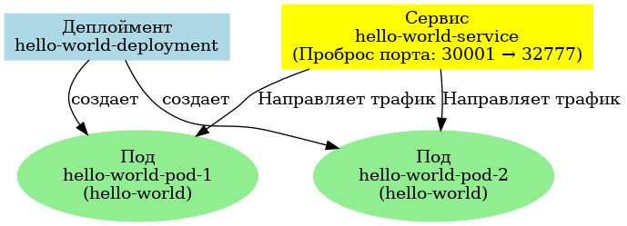

Hello World Kubernetes Project

Описание

Этот проект демонстрирует развертывание простого веб-приложения "Hello World" с использованием Kubernetes и Docker. Приложение реализовано на языке программирования Go.

Содержание репозитория

- main.go: Исходный код веб-приложения на Go.
- Dockerfile: Конфигурация для сборки Docker-образа.
- deployment.yaml: Kubernetes-манифест для развертывания двух реплик приложения.
- service.yaml: Kubernetes-манифест для настройки NodePort-сервиса.
- documentation/:
  - `kubernetes_diagram.png`: Схема архитектуры приложения.
  - Скриншоты:
    - `Состояние_подов.png`: Состояние подов.
    - `Состояние_сервиса.png`: Состояние сервисов.
    - `Работающее_приложение.png`: Работа приложения в браузере.
      
Схема архитектуры

Приложение развернуто в Kubernetes с использованием `Deployment` и `Service`. Сервис типа `NodePort` перенаправляет трафик к подам.

