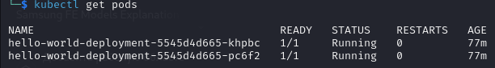
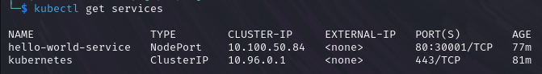

Документация

Схема Kubernetes
Файл `kubernetes_diagram.png` отображает архитектуру приложения:
- Deployment: Создаёт два пода с контейнером `hello-world`.
- Service**: Направляет трафик от порта `30001` к подам через порт `32777`.

Скриншоты
1. Список подов:
   

2. **Список сервисов**:
   

3. **Работающее приложение**:
   
